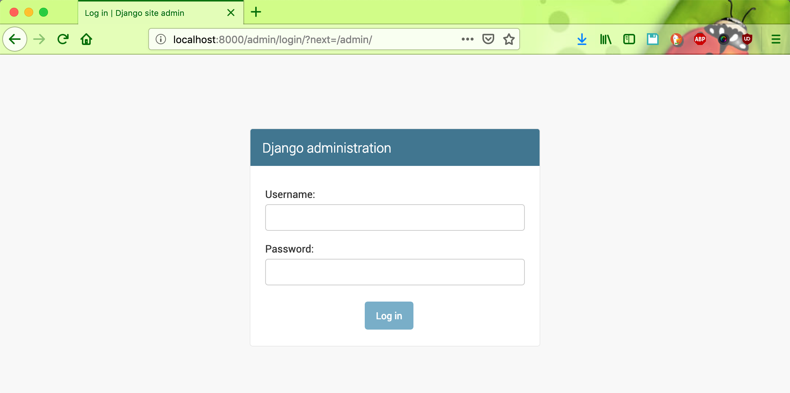
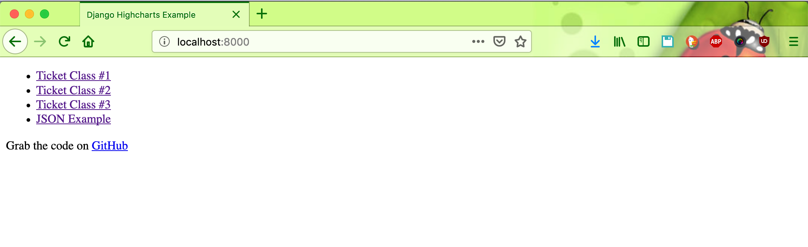
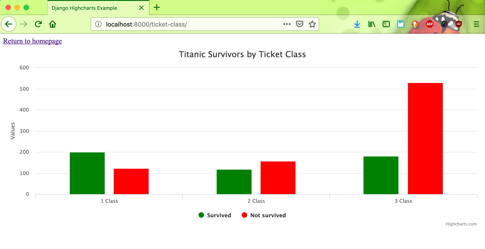
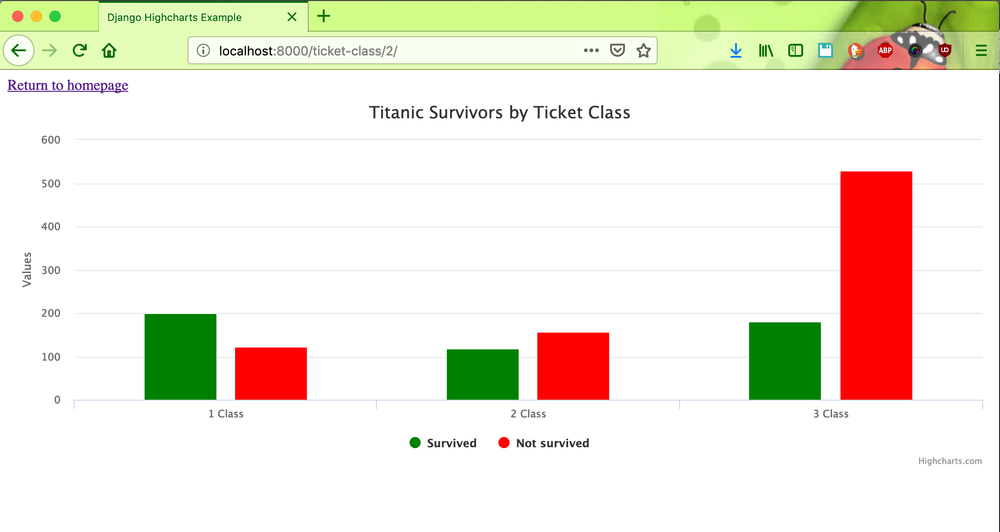

# django-highcharts-example

#### Running the Project Locally

First, clone the repository to your local machine:
```bash
git clone https://github.com/hendisantika/django-highcharts-example.git
```

Install the requirements:
```bash
pip install -r requirements.txt
```

Migrate the database:
```bash
python manage.py migrate
```

The migration will also populate the database.

Create User Login 
```bash
python manage.py createsuperuser
```

Finally, run the development server:

python manage.py runserver

The project will be available at 127.0.0.1:8000.

Log in with your superuser credentials.



Home Page



Ticket Class 1 Page



Ticket Class 2 Page



Ticket Class 3

